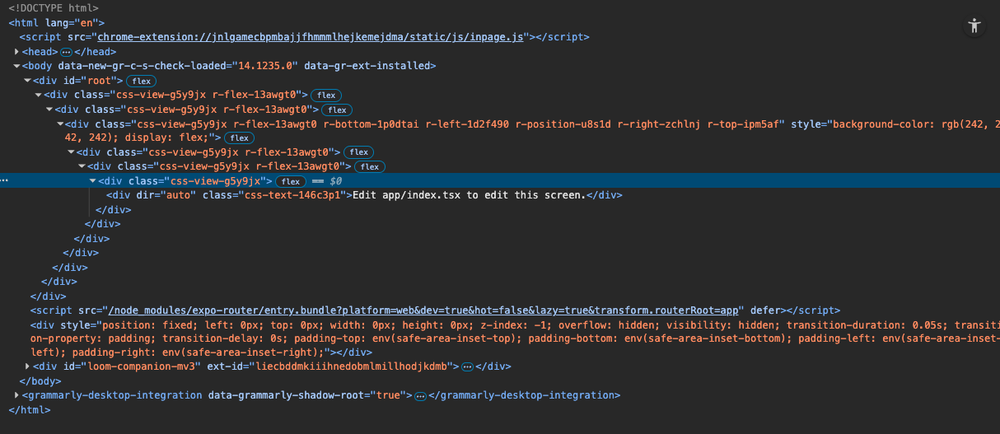
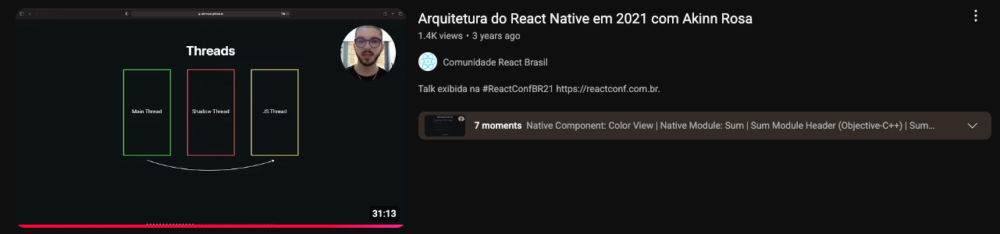

import { Head, Image, Appear } from "mdx-deck";
import Code from "mdx-code";
import { CodeSurfer } from "mdx-deck-code-surfer";

export { default as theme } from "./theme";

import { Intro } from "./Intro";
import { Cover } from "./Cover";
import { ReactNativeApps } from "./ReactNativeApps";
import { Sponsor } from "./Sponsor";
import { Thanks } from "./Thanks";

import { Img } from "./Img";

<Head>
  <title>React Native Universal Apps</title>
</Head>

<Cover />

---

<Intro />

---

## Overview

<ul>
  <Appear>
    <li>What is React Native Universal Apps</li>
    <li>How to build an app</li>
    <li>Use cases and Benefits</li>
    <li>Deep dive and performance</li>
  </Appear>
</ul>

---

## React Native

Is a framework that allows you to build native apps for `[ios, android, web, desktop, tv]` using Javascript and React.

---

## Init Expo App

```bash
npx create-expo-app@latest MyApp
```

---

<div style={{ fontSize: 26 }}>
  <CodeSurfer
    title="Index/App"
    code={require("!raw-loader!./App.js")}
    showNumbers={false}
    dark={true}
    lang="javascript"
    steps={[
      { range: [1, 16], notes: "index.tsx" },
      { range: [5, 12], notes: "index.tsx" },
      { range: [13, 15], notes: "index.tsx" },
    ]}
  />
</div>

---

## New Expo App


---

## Browser HTML



---

<div style={{ fontSize: 26 }}>
  <CodeSurfer
    title="Expo Camera"
    code={require("!raw-loader!./ExpoCamera.js")}
    showNumbers={false}
    dark={true}
    lang="javascript"
    steps={[
      { range: [1, 16], notes: "Camera.tsx" },
    ]}
  />
</div>

---

## Expo Camera


---

## Features

<ul>
  <Appear>
    <li>Native Views</li>
    <li>Native Modules</li>
  </Appear>
</ul>

---

## Packages

<ul>
  <Appear>
    <li>react-native</li>
    <li>react-native-web</li>
    <li>react-native-windows</li>
    <li>react-native-macos</li>
    <li>react-native-tvos</li>
  </Appear>
</ul>

---

<ReactNativeApps />

---

## React Native Old Architecture


---

## React Native Old Architecture


---

## Browser Native Functions


---

## Talk about React Native Architecture



---

<Sponsor />

---

<Thanks />
